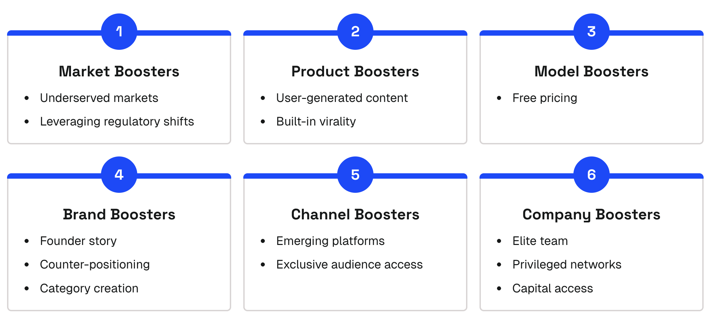

# Catalyst boosters: six types

Now, let's take a look at the Catalyst Boosters, which we organize into six different categories: 

- Market boosters
- Product boosters
- Model boosters
- Brand boosters
- Channel boosters
- Company boosters

.png)

### Market Boosters

.avif)

There are several different types of market boosters. The first and one of the strongest market catalysts is targeting an **underserved market**. 

Essentially, you're playing in a blue ocean. From our product-market fit analysis, a huge component of PMF is having a good market. There are few better ways to have a good market than to identify one that's underserved or entirely neglected.

Now, since this is the first catalyst booster we're looking at, it's a good time to hit on an important point: **Boosters are much less defensible than flywheels. **

An underserved market catalyst is a classic example of that. Yes, it may be a catalyst today, but it's not inherently defensible. If others rush in once they realize your insight, then your catalyst is going to be diminished, if not entirely wiped out.

The next market catalyst is **market or regulatory shifts**. 

For example, if you're early to spot a regulatory shift that was previously making it difficult or impossible to operate in a market. Very similar to the underserved catalyst in that you are, at least for some moment of time, playing in a blue ocean.

Deel is a prime example of a company that benefits from a market shift catalyst. One of the fastest-growing companies we've ever seen. While Deel certainly executed at a high level, there's no arguing that had it not been for their timing and the market forces caused by the pandemic, they wouldn't have experienced anywhere near the rapid growth they did.

### Product Boosters

.avif)

The next category is Product Boosters, and as you can see, most of our catalysts align with our Foundational Five, which is no coincidence.

Product is where the majority of our Flywheel Catalysts exist. But there are also Boosters worth understanding.

**User-generated assets** or artifact creation engines happen when users create content, tools, or resources that attract other users.

Notion's template ecosystem demonstrates this perfectly... users create templates that become marketing content and onboarding resources, attracting new users while creating switching costs (albeit minimal ones) for template creators. This creates a mini network-like effect where user outputs drive ongoing pull.

Next, **built-in product virality. **

Some products are inherently viral. Maybe because they are highly social in nature, arouse strong emotional responses, or carry a “share-worthy” factor that compels users to spread them. When this dynamic is built into the product itself, every new user has the potential to bring in additional users, creating bursts of rapid adoption.

It’s important to note that built-in virality is **not the same as a network effect**. A viral product may spread quickly, but its core value doesn’t necessarily improve as more people use it. The sharing creates distribution, not compounding utility. 

That makes built-in virality powerful but fragile: it can generate early momentum, but it rarely sustains long-term defensibility without being paired with deeper flywheels like network effects.

### Model Boosters

.avif)

Model boosters emerge from your business model mechanics. 

The most common is **free pricing**, which can be a powerful catalyst booster when your cost structure allows you to offer free access while competitors can't afford to. Zoom's efficient architecture allowed seamless, free meetings for enterprise use cases while competitors required paid plans.

It's a short-term unlock with low defensibility unless paired with a flywheel.

And like Scale Flywheels, there’s a major catch. 

Offering a free plan or product isn’t a Growth Catalyst if your competitors are already doing the same. It’s only a true advantage if you're the only player with a free pricing component.

### Brand Boosters

.avif)

Under the Brand category, our first Booster is **founder story**. 

A very simple example would be any celebrity-founded company. They have outsized trust and credibility built in, which is a difficult-to-replicate catalyst compared to any company whose brand or story lacks that dynamic.

Another interesting but less common brand catalyst is **counter-positioning**. 

This occurs when a brand deliberately positions itself in direct contrast to competitors, in a way that makes it nearly impossible for incumbents to follow without undermining their own core business.

The dynamic with counter-positioning is fascinating because it works almost like a trap. When incumbents try to respond, the very act of copying drags them down. Eroding their margins, brand credibility, or distribution model. 

It’s a rare but powerful advantage: you don’t need to fight head-on, you can simply hold your ground and let competitors exhaust themselves trying to play your game, only to weaken their own position in the process.

Take Dollar Shave Club versus Gillette. DSC leaned into humor, irreverence, and direct-to-consumer subscription pricing. If Gillette had matched DSC's pricing and brand approach, it would've undercut their own premium model and damaged their retailer relationships. The harder Gillette fought on DSC's terms, the more they would've hurt their existing business.

And finally, our last brand catalyst is **category creation. **

**‍**This is one of the hardest catalysts to pull off because it requires inventing an entirely new product or market category. Done successfully, it opens up market whitespace where you’re effectively playing in a blue ocean. At least temporarily, until competitors follow. 

The true power comes if you can define and own the category long enough that your brand becomes synonymous with it.

### Channel Boosters

.avif)

The next category, and to wrap up the connection to the Foundational Five, is our channel boosters. Meaning you have some sort of asymmetric or unfair distribution edge.

**Emerging channel timing** occurs when a new distribution platform (early Internet, mobile, VR/AI surfaces) opens a blue-ocean audience with low competition and favorable economics until the channel matures. It's a booster because the window eventually closes.

**Platform or ecosystem catalysts** are distribution catalysts created by your app or extension ecosystem. Third parties build on you, merchants or users discover through your gallery or marketplace, which results in cross-side dynamics at the channel layer. Think Shopify App Store, Slack App Directory, or Notion Template Gallery.

‍**Exclusive audience access** means owning or having privileged access to a large, targeted audience you can reach repeatedly at low cost... like a big newsletter, creator-owned channels, or community.

### Company Boosters

.avif)

Now, our final catalyst category: Company Boosters. 

Company Boosters sit outside of our Foundational Five. Meaning they are an amplifier layer. They can enhance a strong foundation, but they won’t compensate for a weak one.

One is an **elite founding team** with unusually strong talent density.

Another catalyst would be **privileged network access**. 

A founding team that has access to celebrities, partners, suppliers, and investors that other teams simply don't have. OpenAI demonstrates this perfectly. Their privileged network access to Microsoft's distribution and top investors gave them advantages not available to most founding teams.

And then finally, a very well-known and common catalyst is **capital**. Essentially, outsized access to capital.